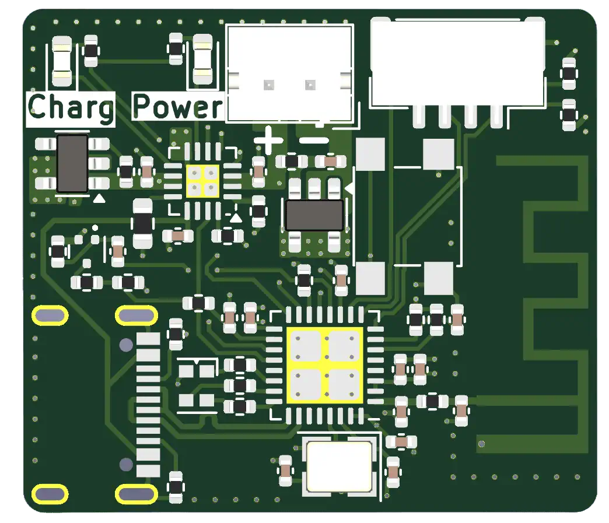
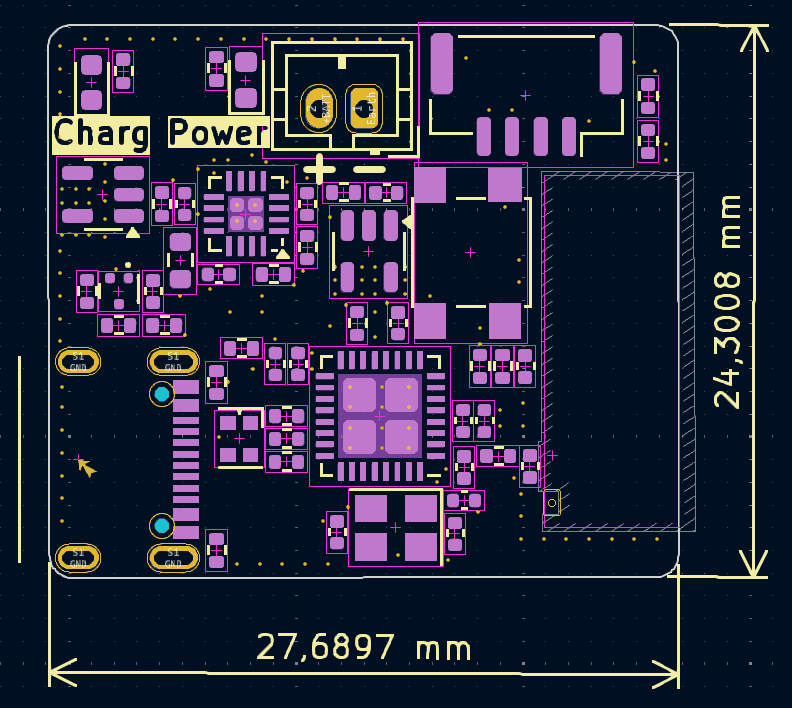

<!-- PROJECT LOGO -->
 

  

  <h3 align="center">Little ESP32 C3 Charger with wireless capabilities</h3>

  

    Here you can find all my project files.
     
    <a href="https://github.com/Ans1S/lil-ESP32-C3"><strong>Explore the docs »</strong></a>
     
     
    <a href="https://github.com/Ans1S/lil-ESP32-C3/issues">Report Bug</a>
  

## PCB Version 1: Advanced Wireless Communication and Power Management

  
  

  

 
 

The objective of this project is to develop a compact ESP32-C3 board with integrated Wi-Fi and Bluetooth capabilities. One of the standout features of this board is its ability to charge a LiPo battery (3.7V) while managing power distribution effectively. This is achieved through the inclusion of a sophisticated power path chip that seamlessly regulates both the charging of the battery and the power supply to the ESP32-C3 via USB.

#### Key Features:

1. **ESP32-C3 Integration**:
   - **Wi-Fi and Bluetooth**: The board leverages the ESP32-C3 microcontroller to provide robust wireless connectivity, supporting both Wi-Fi and Bluetooth communication.
   - **Compact Design**: Designed with a focus on miniaturization, making it suitable for a wide range of applications, from wearables to IoT devices.

2. **Power Management**:
   - **LiPo Battery Charging**: Capable of charging a 3.7V LiPo battery, ensuring your device remains powered even in the absence of a direct power source.
   - **Power Path Chip**: This chip plays a crucial role in managing the dual power sources (battery and USB). It allows for seamless switching between USB power and battery power, ensuring uninterrupted operation of the ESP32-C3.
   - **USB Power Regulation**: When connected to USB, the power path chip efficiently manages the power distribution, providing stable power to the ESP32-C3 while simultaneously charging the battery.

3. **Battery Management**:
   - **Monitoring and Control**: The ESP32-C3 is equipped with features to monitor and control the battery charging process. This includes the ability to track battery levels, regulate charging currents, and implement safety measures to prevent overcharging.
   - **Customizable Charging Profiles**: Through the ESP32-C3, users can customize the charging parameters to optimize for battery longevity and performance, adapting to different battery specifications and use cases.

#### Applications:

This versatile board is ideal for a variety of applications, including but not limited to:
- **IoT Devices**: Providing reliable connectivity and power management for smart home devices, sensors, and other IoT solutions.
- **Wearable Technology**: Offering a compact and efficient solution for wearable tech, ensuring extended battery life and connectivity.
- **Portable Electronics**: Suitable for portable gadgets that require stable wireless communication and efficient power management.

In summary, this project aims to deliver a powerful, compact, and versatile ESP32-C3 board that excels in wireless communication and advanced power management, making it an excellent choice for modern electronic applications.

(<a href="#readme-top">back to top</a>)

## New Chapter: Second Version of the Board

  
   

### Introduction
The second version of our ESP32-C3 board is currently under development and introduces several significant enhancements to improve functionality, power management, and overall performance. This chapter outlines the key improvements and new features of the updated board.

### Key Improvements and Features

1. **I2C Connector**
   - **New Addition**: An I2C connector has been integrated into the board, facilitating easy connection of various I2C peripherals, such as sensors and displays.
   - **Benefits**: This addition simplifies the expansion of the board’s capabilities and makes it more versatile for different applications.

2. **Battery Protection Circuit**
   - **Enhanced Safety**: A dedicated protection circuit for the battery has been included to prevent overcharging, deep discharge, and short circuits.
   - **Advantages**: This ensures the longevity and safety of the battery, making the board more reliable for long-term use.

3. **New Charging IC**
   - **Upgraded Charging IC**: The new charging IC supports a 5V output, enhancing the efficiency of battery charging and power management.
   - **Improved Performance**: This upgrade ensures stable and efficient power delivery, especially important when the board is powered through USB while simultaneously charging the battery.

4. **Low Dropout Regulator (LDO)**
   - **Voltage Regulation**: A new LDO has been added to step down the 5V to 3.3V, which is necessary for powering the ESP32-C3.
   - **Consistent Operation**: This allows the ESP32-C3 to operate consistently even when the battery is at a low charge, ensuring uninterrupted performance.

5. **Battery Level Monitoring**
   - **Feature Addition**: The capability to read the battery’s charge level has been implemented.
   - **User Benefit**: This feature allows users to monitor the battery status in real-time, enabling better power management and timely recharging.

6. **Transition to a 4-Layer PCB**
   - **Design Upgrade**: The board design has been upgraded from a 2-layer PCB to a 4-layer PCB.
   - **Enhanced Performance**: This transition improves signal integrity, reduces electromagnetic interference (EMI), and enhances the overall robustness of the board. It also allows for more efficient layout of components, contributing to better performance and reliability.

### Conclusion
The second version of the ESP32-C3 board brings significant enhancements in power management, safety, and expandability. These improvements ensure that the board remains at the forefront of compact and efficient design, suitable for a wide range of applications from IoT devices to portable electronics. With the integration of new components and a more sophisticated PCB design, the board is poised to deliver even better performance and reliability in various use cases.

(<a href="#readme-top">back to top</a>)

