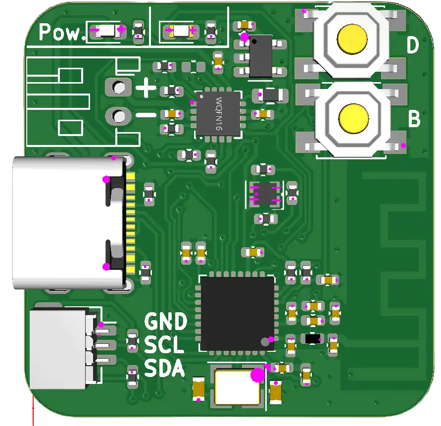

<!-- PROJECT LOGO -->
 

  

  <h3 align="center">Little ESP32 C3 Charger with wireless capabilities</h3>

  

    Here you can find all my project files.
     
    <a href="https://github.com/Ans1S/lil-ESP32-C3"><strong>Explore the docs »</strong></a>
     
     
    <a href="https://github.com/Ans1S/lil-ESP32-C3/issues">Report Bug</a>
  

<!-- ABOUT THE PROJECT -->
## About The Project

  
  

  

 
 

The objective of this project is to develop a compact ESP32-C3 board with integrated Wi-Fi and Bluetooth capabilities. One of the standout features of this board is its ability to charge a LiPo battery (3.7V) while managing power distribution effectively. This is achieved through the inclusion of a sophisticated power path chip that seamlessly regulates both the charging of the battery and the power supply to the ESP32-C3 via USB.

#### Key Features:

1. **ESP32-C3 Integration**:
   - **Wi-Fi and Bluetooth**: The board leverages the ESP32-C3 microcontroller to provide robust wireless connectivity, supporting both Wi-Fi and Bluetooth communication.
   - **Compact Design**: Designed with a focus on miniaturization, making it suitable for a wide range of applications, from wearables to IoT devices.

2. **Power Management**:
   - **LiPo Battery Charging**: Capable of charging a 3.7V LiPo battery, ensuring your device remains powered even in the absence of a direct power source.
   - **Power Path Chip**: This chip plays a crucial role in managing the dual power sources (battery and USB). It allows for seamless switching between USB power and battery power, ensuring uninterrupted operation of the ESP32-C3.
   - **USB Power Regulation**: When connected to USB, the power path chip efficiently manages the power distribution, providing stable power to the ESP32-C3 while simultaneously charging the battery.

3. **Battery Management**:
   - **Monitoring and Control**: The ESP32-C3 is equipped with features to monitor and control the battery charging process. This includes the ability to track battery levels, regulate charging currents, and implement safety measures to prevent overcharging.
   - **Customizable Charging Profiles**: Through the ESP32-C3, users can customize the charging parameters to optimize for battery longevity and performance, adapting to different battery specifications and use cases.

#### Applications:

This versatile board is ideal for a variety of applications, including but not limited to:
- **IoT Devices**: Providing reliable connectivity and power management for smart home devices, sensors, and other IoT solutions.
- **Wearable Technology**: Offering a compact and efficient solution for wearable tech, ensuring extended battery life and connectivity.
- **Portable Electronics**: Suitable for portable gadgets that require stable wireless communication and efficient power management.

In summary, this project aims to deliver a powerful, compact, and versatile ESP32-C3 board that excels in wireless communication and advanced power management, making it an excellent choice for modern electronic applications.

(<a href="#readme-top">back to top</a>)

### PCB Version 2: Enhancements and New Features

The development of the second version of our PCB introduces several key improvements designed to enhance functionality, reliability, and power management. Below are the major upgrades included in this new iteration:

#### Key Enhancements:

1. **I2C Connector**:
   - **Improved Communication**: The addition of an I2C connector facilitates easier and more reliable communication between the ESP32-C3 and other peripheral devices. This enables the integration of various sensors and modules without complex wiring.

2. **Battery Protection Circuit**:
   - **Enhanced Safety**: A new protection circuit for the battery has been implemented to prevent overcharging, over-discharging, and short circuits. This ensures the longevity and safety of the battery, providing more robust power management.

3. **New Charging IC with 5V Output**:
   - **Efficient Power Conversion**: The upgraded charging IC provides a stable 5V output, which improves the efficiency of power conversion and ensures a consistent power supply to the ESP32-C3 and other connected components.

4. **Low Dropout Regulator (LDO)**:
   - **Stable Voltage Regulation**: A new LDO has been added to step down the 5V from the charging IC to 3.3V, the operating voltage for the ESP32-C3. This ensures that the microcontroller can operate efficiently even when the battery charge is low.

5. **Battery Level Monitoring**:
   - **Accurate Power Management**: The updated design includes the capability to read the battery charge level. This feature allows the ESP32-C3 to monitor the battery status accurately, enabling smarter power management and alerting users when the battery is low.

#### Benefits of the Upgrades:

- **Enhanced Connectivity**: The I2C connector simplifies the addition of various peripherals, making the board more versatile and easier to integrate into different projects.
- **Improved Safety and Reliability**: The battery protection circuit ensures safer operation and prolongs battery life by preventing common battery-related issues.
- **Better Power Efficiency**: With the new charging IC and LDO, power conversion is more efficient, leading to better performance and longer battery life for the device.
- **Continuous Operation**: The combination of improved power management features ensures that the ESP32-C3 can continue to operate even under low battery conditions, making it more reliable for critical applications.
- **Smarter Power Management**: The ability to monitor battery levels allows for better decision-making in power usage, potentially extending the operational time of battery-powered applications.

These enhancements make the second version of our PCB a more robust and versatile solution, capable of supporting a wide range of applications with improved efficiency and reliability.

(<a href="#readme-top">back to top</a>)

[linkedin-shield]: https://img.shields.io/badge/-LinkedIn-black.svg?style=for-the-badge&logo=linkedin&colorB=555
[linkedin-url]: https://www.linkedin.com/company/digitalpowersystems/
[product-screenshot]: Readme/Produktpalette.webp
