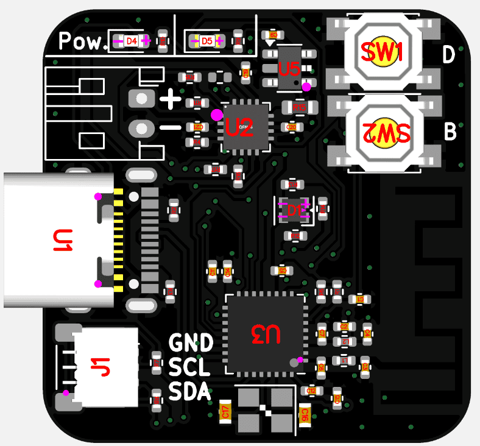

<!-- PROJECT LOGO -->
 

  

  <h3 align="center">Little ESP32 C3 Charger with with wireless capabilities</h3>

  

    Here you can find all my project files.
     
    <a href="https://github.com/Ans1S/lil-ESP32-C3"><strong>Explore the docs »</strong></a>
     
     
    <a href="https://github.com/Ans1S/lil-ESP32-C3/issues">Report Bug</a>
  

<!-- ABOUT THE PROJECT -->
## About The Project

  

 
 

(<a href="#readme-top">back to top</a>)

[linkedin-shield]: https://img.shields.io/badge/-LinkedIn-black.svg?style=for-the-badge&logo=linkedin&colorB=555
[linkedin-url]: https://www.linkedin.com/company/digitalpowersystems/
[product-screenshot]: Readme/Produktpalette.webp
